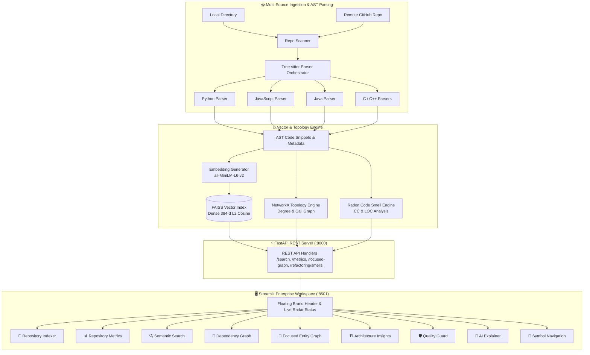

# 🧠 AI Code Intelligence Engine

<div align="center">

[](https://www.python.org/)
[](https://fastapi.tiangolo.com/)
[](https://streamlit.io/)
[](https://github.com/facebookresearch/faiss)
[](https://tree-sitter.github.io/)
[](https://github.com/Spandan228/ai-code-intelligence-engine/actions)
[](#-testing)
[](#-render-cloud-deployment)
[](LICENSE)

**An enterprise-grade developer intelligence platform for multi-language AST parsing, dense vector semantic search, interactive dependency topology, and automated code quality auditing.**

[Key Features](#-key-features) • [Architecture](#-architecture) • [Quick Start](#-quick-start) • [Render Cloud](#-render-cloud-deployment) • [Docker Deployment](#-docker-deployment) • [REST API](#-rest-api-documentation) • [Testing](#-testing) • [Contributing](CONTRIBUTING.md)

</div>

---

## 🌟 Overview

Modern software engineering often requires navigating sprawling codebases with thousands of interconnected functions, classes, and cross-package dependencies. Traditional keyword search tools (e.g., `grep` or standard IDE text searches) struggle to understand developer intent or map macro-architectural dependencies.

The **AI Code Intelligence Engine** solves this challenge by combining **multi-language Abstract Syntax Tree (AST) parsing**, **384-dimensional dense semantic embeddings**, **FAISS vector indexing**, and **NetworkX topological graph analytics** into a unified, responsive developer workspace.

### Who is this for?
- **Engineers Onboarding to Large Codebases**: Quickly locate logic by asking natural language questions rather than guessing exact function names.
- **Architects & Tech Leads**: Visualize package coupling, identify high-degree architectural hubs, and assess module coupling densities.
- **Developers Refactoring Legacy Systems**: Detect high cyclomatic complexity ($CC > 10$) routines and oversized functions with automated remediation guidance.

---

## 🚀 Key Features

| Capability | Description |
| :--- | :--- |
| **📁 Multi-Source Ingestion** | Index local directories or clone and vectorize remote GitHub repositories directly from the UI or CLI with automatic `.git` exclusion. |
| **🔍 Semantic Code Search** | Natural language intent search powered by `sentence-transformers/all-MiniLM-L6-v2` and FAISS `IndexFlatIP` cosine similarity ranking. |
| **📊 Repository Analytics** | 5 Hero KPI pods (Functions, Classes, Files, Modules, Dependencies) with Connectivity Hotspot progress meters and Entity Composition ratios. |
| **🧩 Dependency Call Graph** | Interactive whole-repository call graph with layout physics switches (`Force-Directed`, `Kamada-Kawai`), node budget limits, and degree filters. |
| **🎯 Focused Entity Graph** | Radial concentric bipartite isolation showing inbound callers on the left semicircle and outbound callees on the right semicircle with dynamic hub suggestion chips. |
| **🏗️ Architecture Insights** | Balanced two-column view featuring a 360° Circular Package Shell Map and a Package Coupling Telemetry Table. |
| **🛡️ Quality Guard & Smells** | Automated Radon cyclomatic complexity and large method smell detection, 3-tier Severity Risk Matrix (Critical, High, Medium), and prioritized refactoring candidates. |
| **🤖 Contextual AI Explainer** | Multi-section architectural synthesis retrieving semantic nearest-neighbors to explain entity roles, related symbols, and refactoring tips. |
| **🧭 Symbol Navigation** | Precise AST declaration coordinate jumps and cross-file call-site reference tracking across the codebase. |

---

## 🏗️ Architecture



---

## 🛠️ Tech Stack

- **Core Runtime**: Python 3.10 / 3.11+
- **Backend API**: FastAPI, Uvicorn, Pydantic, HTTPX
- **Frontend UI**: Streamlit (Reference Design System, Plus Jakarta Sans, JetBrains Mono)
- **AST Parsing Engine**: Tree-sitter (`tree-sitter-python`, `tree-sitter-javascript`, `tree-sitter-java`, `tree-sitter-c`, `tree-sitter-cpp`)
- **Vector Embeddings & Database**: Sentence-Transformers (`all-MiniLM-L6-v2`), FAISS-CPU (`IndexFlatIP`)
- **Graph & Data Visualization**: NetworkX, Plotly, NumPy, Pandas
- **Code Quality Analysis**: Radon (Cyclomatic Complexity & Halstead Metrics)
- **Automated Testing & CI/CD**: Pytest, GitHub Actions, Docker, Docker Compose

---

## 📁 Project Structure

```text
ai-code-intelligence-engine/
├── .github/
│   ├── workflows/
│   │   ├── ci.yml                # Multi-OS & multi-Python GitHub Actions CI pipeline
│   │   └── cd-release.yml        # Automated GitHub release packaging pipeline
│   ├── ISSUE_TEMPLATE/           # Bug report & feature request templates
│   └── pull_request_template.md  # Pull request review checklist
├── ai_explainer/                 # Semantic neighborhood context synthesis
├── analysis/                     # Repository metrics, focused graphs & architecture maps
├── api/                          # FastAPI application server and REST route contracts
├── data/                         # Local storage for FAISS indices and metadata
├── dependency_graph/             # NetworkX call graph builder and Plotly visualizer
├── indexer/                      # Multi-source scanning, language detection & embedding pipeline
├── navigation/                   # AST symbol declaration and cross-file usage finder
├── parsers/                      # Tree-sitter AST parsers for Python, JS, Java, C, and C++
├── refactoring/                  # Radon code smell detection (CC > 10, LOC > 50)
├── scripts/                      # CLI indexing utilities (index_repository.py)
├── search/                       # FAISS cosine vector search engine
├── tests/                        # 25 automated unit, integration, and security tests
├── ui/                           # Streamlit enterprise dashboard and Bento components
├── utils/                        # Shared logging, paths, and configuration
├── .dockerignore                 # Exclusions for container build context
├── .editorconfig                 # Cross-editor formatting specifications
├── .env.example                  # Environment configuration template
├── .gitignore                    # Git ignore specifications
├── CHANGELOG.md                  # Semantic versioning changelog
├── CONTRIBUTING.md               # Developer contribution guidelines
├── CODE_OF_CONDUCT.md           # Contributor Covenant v2.1
├── Dockerfile                    # Production container specification
├── docker-compose.yml            # One-command multi-service container configuration
├── LICENSE                       # MIT License
├── requirements.txt              # Core Python dependencies
├── ROADMAP.md                    # Project roadmap and milestones
├── SECURITY.md                   # Security reporting and support policy
└── README.md                     # Flagship repository documentation
```

---

## ⚡ Quick Start

### 1. Prerequisites
- **Python 3.10 or 3.11+** installed on your system.
- **Git** for version control.

### 2. Clone and Setup Environment
```bash
# Clone the repository
git clone https://github.com/Spandan228/ai-code-intelligence-engine.git
cd ai-code-intelligence-engine

# Create and activate a virtual environment
python -m venv venv

# On Linux / macOS:
source venv/bin/activate

# On Windows (PowerShell):
venv\Scripts\Activate.ps1
```

### 3. Install Dependencies
```bash
pip install --upgrade pip
pip install -r requirements.txt
```

### 4. (Optional) Configure Environment
Copy the example environment configuration:
```bash
cp .env.example .env
```

---

## 🖥️ Running the Application

The engine consists of two services running in tandem: the **FastAPI REST Server** and the **Streamlit Web Dashboard**.

### Step 1: Launch the FastAPI Backend
```bash
python -m uvicorn api.server:app --host 127.0.0.1 --port 8000 --reload
```
- **API Base URL**: `http://127.0.0.1:8000`
- **Interactive Swagger Docs**: [http://127.0.0.1:8000/docs](http://127.0.0.1:8000/docs)
- **OpenAPI JSON Spec**: `http://127.0.0.1:8000/openapi.json`

### Step 2: Launch the Streamlit Dashboard
In a separate terminal window:
```bash
python -m streamlit run ui/dashboard.py --server.port 8501
```
- **Dashboard Interface**: [http://localhost:8501](http://localhost:8501)

---

## 🐳 Docker Deployment

You can deploy the entire engine in a containerized environment with a single command:

```bash
# Build and run both FastAPI and Streamlit via Docker Compose
docker compose up -d --build
```

- **Streamlit UI**: [http://localhost:8501](http://localhost:8501)
- **FastAPI Backend**: [http://localhost:8000](http://localhost:8000)

To stop the services:
```bash
docker compose down
```

---

## ☁️ Render Cloud Deployment

The repository includes a ready-to-use **Render Blueprint** (`render.yaml`) to deploy both the **FastAPI Backend** and the **Streamlit Frontend** on [Render](https://render.com).

[](https://render.com/deploy?repo=https://github.com/Spandan228/ai-code-intelligence-engine)

### Step-by-Step Render Deployment:
1. Fork or push this repository to your GitHub account.
2. Log in to your [Render Dashboard](https://dashboard.render.com/).
3. Navigate to **Blueprints** and click **New Blueprint Instance**.
4. Connect your repository (`ai-code-intelligence-engine`).
5. Render will automatically read `render.yaml` and configure:
   - **`ai-code-intelligence-api`** (FastAPI Web Service on Python 3.10)
   - **`ai-code-intelligence-dashboard`** (Streamlit Web Service linked dynamically via `API_BASE_URL`)
6. Click **Apply** to deploy both services automatically!

---

## 💻 CLI Scripting

You can also index any codebase directly from the command line without opening the web interface:

```bash
# Index a local codebase via CLI
python scripts/index_repository.py /path/to/your/project
```

---

## 📡 REST API Documentation

### 1. Index Local Repository
```bash
curl -X POST "http://127.0.0.1:8000/index/local" \
     -H "Content-Type: application/json" \
     -d '{"path": "G:/project"}'
```
**Response:**
```json
{
  "status": "success",
  "indexed_files": 41,
  "snippets": 134
}
```

### 2. Natural Language Semantic Search
```bash
curl -X POST "http://127.0.0.1:8000/search" \
     -H "Content-Type: application/json" \
     -d '{"query": "AST parsing orchestrator", "top_k": 3}'
```
**Response:**
```json
{
  "results": [
    {
      "name": "CodeParserOrchestrator",
      "file_path": "indexer/code_parser.py",
      "type": "class",
      "language": "python",
      "start_line": 15,
      "score": 0.536,
      "code_snippet": "class CodeParserOrchestrator:\n    def __init__(self):\n..."
    }
  ]
}
```

### 3. Repository Analytics & Hotspots
```bash
curl -X GET "http://127.0.0.1:8000/metrics"
```
**Response:**
```json
{
  "number_of_functions": 502,
  "number_of_classes": 123,
  "number_of_files": 43,
  "number_of_modules": 15,
  "total_dependencies": 2521,
  "most_connected_nodes": [
    ["CodeParserOrchestrator", 145],
    ["CodeParser", 125],
    ["FaissIndex", 121]
  ]
}
```

### 4. Code Smells & Refactoring Audit
```bash
curl -X GET "http://127.0.0.1:8000/refactoring/smells"
```
**Response:**
```json
{
  "count": 89,
  "smells": [
    {
      "file": "indexer/code_parser.py",
      "type": "High Complexity",
      "details": "Function 'parse_file' has CC = 14",
      "severity": "Critical"
    }
  ]
}
```

### 5. Contextual AI Code Explanation
```bash
curl -X POST "http://127.0.0.1:8000/explain" \
     -H "Content-Type: application/json" \
     -d '{"code_snippet": "def authenticate(username, password): return verify_credentials(username, password)"}'
```

---

## 🔬 Testing

The repository includes an automated test suite verifying AST parsers, vector embeddings, graph algorithms, code smell detectors, and FastAPI endpoints with full input validation and error handling.

### Run All Tests
```bash
python -m pytest tests/ -v
```

### Test Suite Summary:
```text
tests/test_api_endpoints.py .                                            [  4%]
tests/test_full_suite.py ..............                                  [ 60%]
tests/test_parsers.py .                                                  [ 64%]
tests/test_robustness_and_security.py .........                          [100%]

============================= 25 passed in 11.13s =============================
```

---

## 🤝 Contributing

Contributions are welcomed and appreciated! Please review our [Contributing Guide](CONTRIBUTING.md) and [Code of Conduct](CODE_OF_CONDUCT.md) before submitting pull requests.

1. Fork the repository.
2. Create a feature branch (`git checkout -b feature/amazing-feature`).
3. Commit your changes (`git commit -m 'feat: add amazing feature'`).
4. Push to the branch (`git push origin feature/amazing-feature`).
5. Open a Pull Request.

---

## 📄 License

This project is licensed under the **MIT License** - see the [LICENSE](LICENSE) file for details.

---

<div align="center">
Built with ❤️ using Python, FastAPI, FAISS, Tree-sitter, NetworkX, and Streamlit.
</div>
