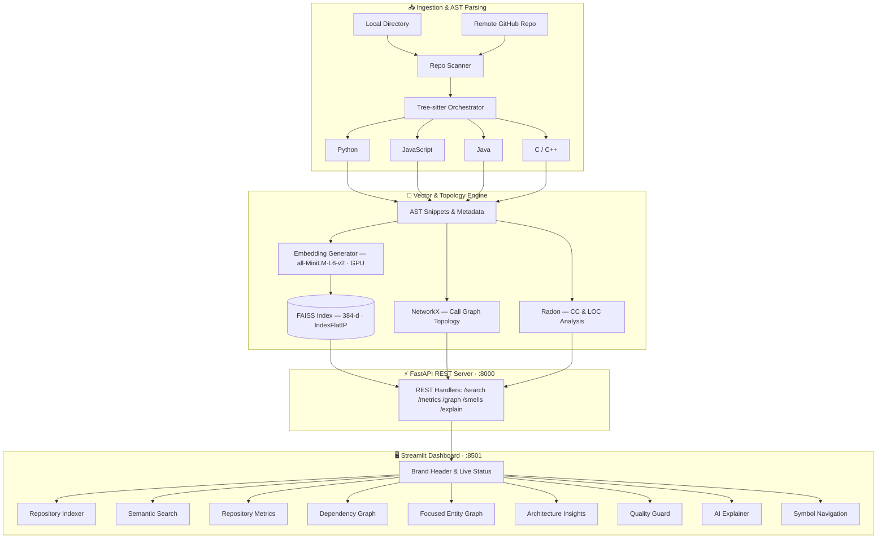

<div align="center">

<h1>🧠 AI Code Intelligence Engine</h1>

<p><strong>An enterprise-grade developer intelligence platform combining multi-language AST parsing, dense semantic vector search, interactive dependency topology, and AI-powered code quality auditing — designed for GPU-accelerated local deployment.</strong></p>

<br/>

[](https://www.python.org/)
[](https://fastapi.tiangolo.com/)
[](https://streamlit.io/)
[](https://github.com/facebookresearch/faiss)
[](https://tree-sitter.github.io/)
[](https://github.com/Spandan228/ai-code-intelligence-engine/actions)
[](https://github.com/Spandan228/ai-code-intelligence-engine/actions)
[](LICENSE)

<br/>

[Overview](#-overview) •
[Features](#-key-features) •
[Architecture](#-architecture) •
[Requirements](#-requirements) •
[Quick Start](#-quick-start) •
[Running](#-running-the-application) •
[Docker](#-docker-deployment) •
[API Reference](#-rest-api-reference) •
[Testing](#-testing) •
[Troubleshooting](#-troubleshooting) •
[Contributing](CONTRIBUTING.md)

</div>

---

## 🌟 Overview

Modern codebases are vast. Tens of thousands of functions, cross-package call chains, legacy logic buried across dozens of modules — navigating them with `grep` or plain IDE text search breaks down fast. You need **intent-aware search**, not keyword matching.

The **AI Code Intelligence Engine** is a full-stack developer intelligence platform that combines:

- 🔬 **Multi-language Abstract Syntax Tree parsing** — understands the *structure* of your code, not just the text
- 🧠 **384-dimensional dense semantic embeddings** — finds code by *what it does*, not just *what it is called*
- ⚡ **FAISS vector indexing with GPU acceleration** — sub-millisecond similarity search across hundreds of thousands of snippets
- 🕸️ **NetworkX topological graph analytics** — maps your entire dependency topology, identifies architectural hubs, and surfaces coupling hotspots
- 🛡️ **Automated Radon code smell detection** — flags cyclomatic complexity violations and oversized routines with remediation guidance

All assembled into a single, self-hosted Streamlit workspace — no cloud, no vendor lock-in, full GPU utilisation.

### Who is this for?

| Role | Use Case |
|------|----------|
| **Engineers onboarding** | Locate logic instantly with natural language instead of guessing exact symbol names |
| **Architects & Tech Leads** | Visualise package coupling, identify high-degree hubs, and assess module cohesion density |
| **Refactoring teams** | Detect high-CC routines and oversized functions with AI-generated remediation guidance |
| **Security reviewers** | Trace cross-file call chains to identify blast-radius of a given function |

---

## 🚀 Key Features

| Capability | Description |
|:-----------|:------------|
| **Multi-Source Ingestion** | Index local directories or clone and vectorize public GitHub repositories. Automatic `.git`, `node_modules`, and `.venv` exclusion. |
| **Semantic Code Search** | Natural language intent search via `all-MiniLM-L6-v2` + FAISS `IndexFlatIP` cosine ranking. Returns ranked result cards with exact similarity scores, file breadcrumbs, and syntax-highlighted snippets. |
| **Repository Analytics** | 5 Hero KPI pods (Functions, Classes, Files, Modules, Dependencies) with Connectivity Hotspot progress meters and Entity Composition ratios. |
| **Dependency Call Graph** | Interactive whole-repository call graph with layout-physics switches (`Force-Directed`, `Kamada-Kawai`), node budget sliders, and degree filters. |
| **Focused Entity Graph** | Radial concentric bipartite isolation: inbound callers on the left semicircle, outbound callees on the right — with dynamic hub suggestion chips. |
| **Architecture Insights** | 360 Degree Circular Package Shell Map + Package Coupling Telemetry Table in a balanced two-column layout. |
| **Quality Guard & Code Smells** | Radon cyclomatic complexity + large-method detection. 3-tier Severity Risk Matrix (Critical / High / Medium) with prioritised refactoring candidates. |
| **Contextual AI Explainer** | Semantic nearest-neighbor retrieval synthesises architectural context, related symbols, and refactoring tips for any code snippet. |
| **Symbol Navigation** | Precise AST declaration-coordinate jumps and cross-file call-site reference tracking. |

---

## 🏗️ Architecture



---

## 🛠️ Tech Stack

| Layer | Technology |
|-------|-----------|
| **Runtime** | Python 3.10 / 3.11 |
| **Backend API** | FastAPI, Uvicorn, Pydantic v2, HTTPX |
| **Frontend UI** | Streamlit (Plus Jakarta Sans, JetBrains Mono) |
| **AST Parsing** | Tree-sitter (python, javascript, java, c, cpp) |
| **Embeddings** | Sentence-Transformers `all-MiniLM-L6-v2` (384-d, quantized) |
| **Vector Store** | FAISS `IndexFlatIP` (CPU / GPU switchable) |
| **Graph Engine** | NetworkX, Plotly |
| **Code Quality** | Radon (Cyclomatic Complexity & Halstead Metrics) |
| **Testing & CI** | Pytest, GitHub Actions |
| **Containerisation** | Docker, Docker Compose |

---

## 📋 Requirements

### System Requirements

| Component | Minimum | Recommended |
|-----------|---------|-------------|
| **OS** | Windows 10, Ubuntu 20.04, macOS 12 | Ubuntu 22.04 / Windows 11 |
| **Python** | 3.10 | 3.11 |
| **RAM** | 8 GB | 16 GB+ |
| **GPU VRAM** | 4 GB (CUDA 11.8+) | 8 GB+ (CUDA 12.x) |
| **Disk** | 4 GB free | 10 GB+ free |
| **Git** | 2.30+ | latest |

> **GPU Note:** This engine is GPU-accelerated by design. The embedding pipeline automatically detects and utilises a CUDA-capable GPU. On CPU-only machines it will still run, but indexing large repositories will be significantly slower. Install the appropriate PyTorch GPU wheels **before** running `pip install -r requirements.txt` (see [GPU Setup](#3-gpu-setup) below).

### Software Prerequisites

- [Python 3.10+](https://www.python.org/downloads/)
- [Git 2.30+](https://git-scm.com/)
- [CUDA Toolkit 11.8+](https://developer.nvidia.com/cuda-downloads) *(for GPU acceleration)*
- [Docker Desktop](https://www.docker.com/products/docker-desktop/) *(optional, for containerised deployment)*

---

## ⚡ Quick Start

### 1. Clone the Repository

```bash
git clone https://github.com/Spandan228/ai-code-intelligence-engine.git
cd ai-code-intelligence-engine
```

### 2. Create a Virtual Environment

```bash
python -m venv venv

# Linux / macOS
source venv/bin/activate

# Windows (PowerShell)
venv\Scripts\Activate.ps1
```

### 3. GPU Setup

Install the GPU-enabled PyTorch build matching your CUDA version **before** installing other dependencies:

```bash
# CUDA 12.x (recommended)
pip install torch --index-url https://download.pytorch.org/whl/cu121

# CUDA 11.8
pip install torch --index-url https://download.pytorch.org/whl/cu118

# CPU-only (slower, but functional)
pip install torch
```

### 4. Install Python Dependencies

```bash
pip install --upgrade pip
pip install -r requirements.txt
```

### 5. Configure Environment *(optional)*

```bash
cp .env.example .env
# Edit .env to customise ports, log levels, and GPU device preferences
```

---

## 🖥️ Running the Application

The engine runs as two services in tandem. Open **two terminal windows**.

### Terminal 1 — FastAPI Backend

```bash
python -m uvicorn api.server:app --host 127.0.0.1 --port 8000 --reload
```

| Endpoint | URL |
|----------|-----|
| API Base | `http://127.0.0.1:8000` |
| Swagger UI | http://127.0.0.1:8000/docs |
| OpenAPI Spec | `http://127.0.0.1:8000/openapi.json` |

### Terminal 2 — Streamlit Dashboard

```bash
python -m streamlit run ui/dashboard.py --server.port 8501
```

Dashboard is available at: http://localhost:8501

> **Tip:** The Streamlit header will display a live `ONLINE` badge once it successfully reaches the FastAPI backend.

---

## 🐳 Docker Deployment

Deploy the full stack with a single command:

```bash
# Build and start both services (detached)
docker compose up -d --build

# View live logs
docker compose logs -f

# Stop all services
docker compose down
```

| Service | URL |
|---------|-----|
| Streamlit UI | http://localhost:8501 |
| FastAPI Backend | http://localhost:8000 |

> **Note:** Docker containers run on CPU by default. To enable GPU passthrough, install the [NVIDIA Container Toolkit](https://docs.nvidia.com/datacenter/cloud-native/container-toolkit/install-guide.html) and add the `deploy.resources.reservations.devices` block to `docker-compose.yml`.

---

## 💻 CLI Scripting

Index any codebase directly from the command line without the web interface:

```bash
# Index a local directory
python scripts/index_repository.py /path/to/your/project
```

---

## 📡 REST API Reference

All endpoints return `application/json`. The interactive Swagger UI at `/docs` provides a live request/response playground.

### `POST /index/local` — Index Local Repository

```bash
curl -X POST "http://127.0.0.1:8000/index/local" \
     -H "Content-Type: application/json" \
     -d '{"path": "/path/to/your/project"}'
```

**Response:**
```json
{
  "status": "success",
  "indexed_files": 41,
  "snippets": 157
}
```

---

### `POST /index/github` — Clone & Index Remote Repository

```bash
curl -X POST "http://127.0.0.1:8000/index/github" \
     -H "Content-Type: application/json" \
     -d '{"url": "https://github.com/owner/repo"}'
```

---

### `POST /search` — Semantic Code Search

```bash
curl -X POST "http://127.0.0.1:8000/search" \
     -H "Content-Type: application/json" \
     -d '{"query": "AST parsing orchestrator", "top_k": 5}'
```

**Response:**
```json
{
  "results": [
    {
      "name": "CodeParserOrchestrator",
      "file_path": "indexer/code_parser.py",
      "type": "class",
      "language": "python",
      "start_line": 15,
      "score": 0.781,
      "code_snippet": "class CodeParserOrchestrator:\n    def __init__(self):\n..."
    }
  ]
}
```

---

### `GET /metrics` — Repository Analytics

```bash
curl http://127.0.0.1:8000/metrics
```

**Response:**
```json
{
  "number_of_functions": 130,
  "number_of_classes": 27,
  "number_of_files": 41,
  "number_of_modules": 12,
  "total_dependencies": 732,
  "most_connected_nodes": [
    ["CodeParserOrchestrator", 145],
    ["FaissIndex", 121],
    ["EmbeddingGenerator", 98]
  ]
}
```

---

### `GET /refactoring/smells` — Code Smell Audit

```bash
curl http://127.0.0.1:8000/refactoring/smells
```

**Response:**
```json
{
  "count": 34,
  "smells": [
    {
      "file": "indexer/code_parser.py",
      "type": "High Complexity",
      "details": "Function 'parse_file' has CC = 14",
      "severity": "Critical"
    }
  ]
}
```

---

### `POST /explain` — AI Code Explainer

```bash
curl -X POST "http://127.0.0.1:8000/explain" \
     -H "Content-Type: application/json" \
     -d '{"code_snippet": "def authenticate(user, pwd): return verify_credentials(user, pwd)"}'
```

---

### `GET /graph` — Dependency Call Graph

```bash
curl "http://127.0.0.1:8000/graph?max_nodes=200&min_degree=2"
```

---

### `POST /navigation/find` — Symbol Navigation

```bash
curl -X POST "http://127.0.0.1:8000/navigation/find" \
     -H "Content-Type: application/json" \
     -d '{"symbol": "CodeParserOrchestrator"}'
```

---

## 📁 Project Structure

```text
ai-code-intelligence-engine/
├── .github/
│   ├── workflows/
│   │   ├── ci.yml                # Multi-OS, multi-Python GitHub Actions CI
│   │   └── cd-release.yml        # Automated GitHub Release packaging
│   ├── ISSUE_TEMPLATE/           # Bug report & feature request templates
│   └── pull_request_template.md  # PR review checklist
│
├── ai_explainer/                 # Semantic neighborhood context synthesis
├── analysis/                     # Repo metrics, focused graphs & architecture maps
├── api/                          # FastAPI application, routes, CORS & lifespan
├── data/                         # Local FAISS index and metadata persistence
├── dependency_graph/             # NetworkX call graph builder & Plotly visualiser
├── indexer/                      # Multi-source scanning, language detection & embedding
├── navigation/                   # AST declaration lookup & cross-file usage finder
├── parsers/                      # Tree-sitter parsers: Python, JS, Java, C, C++
├── refactoring/                  # Radon code smell detection (CC > 10, LOC > 50)
├── scripts/                      # CLI utilities (index_repository.py)
├── search/                       # FAISS cosine similarity search engine
├── tests/                        # 31 unit, integration, robustness & security tests
├── ui/                           # Streamlit dashboard & Bento UI components
├── utils/                        # Shared logging, paths & configuration helpers
├── vector_store/                 # FAISS index lifecycle (load, save, reset)
│
├── .dockerignore                 # Container build context exclusions
├── .editorconfig                 # Cross-editor formatting specification
├── .env.example                  # Environment variable template
├── .gitignore                    # Git ignore rules
├── CHANGELOG.md                  # Semantic versioning release history
├── CODE_OF_CONDUCT.md            # Contributor Covenant v2.1
├── CONTRIBUTING.md               # Developer contribution guidelines
├── Dockerfile                    # Production container specification
├── docker-compose.yml            # One-command multi-service orchestration
├── LICENSE                       # MIT License
├── pyproject.toml                # Build config, linting & pytest settings
├── requirements.txt              # Core Python dependencies
├── ROADMAP.md                    # Project milestones & future direction
├── SECURITY.md                   # Vulnerability disclosure policy
└── README.md                     # This document
```

---

## 🔬 Testing

The repository ships with a comprehensive automated test suite covering AST parsers, vector embeddings, graph algorithms, API endpoints, code smell detectors, robustness edge cases, and security input validation.

### Run All Tests

```bash
python -m pytest tests/ -v
```

### Run a Specific Suite

```bash
# Core functionality
python -m pytest tests/test_full_suite.py -v

# API endpoint integration
python -m pytest tests/test_api_endpoints.py -v

# Robustness & security
python -m pytest tests/test_robustness_and_security.py -v

# Advanced feature coverage
python -m pytest tests/test_advanced_features.py -v
```

### Current Test Results

```
tests/test_advanced_features.py::test_cors_headers                                           PASSED
tests/test_advanced_features.py::test_ai_explainer_multi_paradigms                          PASSED
tests/test_advanced_features.py::test_repo_scanner_ignore_rules                             PASSED
tests/test_advanced_features.py::test_embedding_generator_properties                        PASSED
tests/test_advanced_features.py::test_architecture_coupling_analytics                       PASSED
tests/test_advanced_features.py::test_focused_neighborhood_graph                            PASSED
tests/test_api_endpoints.py::test_live_api_lifecycle                                        PASSED
tests/test_full_suite.py::test_python_parser                                                PASSED
tests/test_full_suite.py::test_javascript_parser                                            PASSED
tests/test_full_suite.py::test_java_parser                                                  PASSED
tests/test_full_suite.py::test_c_parser                                                     PASSED
tests/test_full_suite.py::test_cpp_parser                                                   PASSED
tests/test_full_suite.py::test_language_detector                                            PASSED
tests/test_full_suite.py::test_repo_scanner_and_orchestrator                                PASSED
tests/test_full_suite.py::test_faiss_vector_store                                           PASSED
tests/test_full_suite.py::test_dependency_graph                                             PASSED
tests/test_full_suite.py::test_repo_metrics_and_architecture                                PASSED
tests/test_full_suite.py::test_code_smells_detection                                        PASSED
tests/test_full_suite.py::test_ai_explainer                                                 PASSED
tests/test_full_suite.py::test_code_navigation                                              PASSED
tests/test_full_suite.py::test_api_endpoints                                                PASSED
tests/test_parsers.py::test_extraction                                                      PASSED
tests/test_robustness_and_security.py::test_index_local_invalid_paths                      PASSED
tests/test_robustness_and_security.py::test_index_github_invalid_urls                      PASSED
tests/test_robustness_and_security.py::test_search_edge_cases                              PASSED
tests/test_robustness_and_security.py::test_focused_graph_edge_cases                       PASSED
tests/test_robustness_and_security.py::test_explain_edge_cases                             PASSED
tests/test_robustness_and_security.py::test_navigation_edge_cases                          PASSED
tests/test_robustness_and_security.py::test_parsers_on_empty_and_corrupted_code            PASSED
tests/test_robustness_and_security.py::test_parser_orchestrator_nonexistent_and_unsupported PASSED
tests/test_robustness_and_security.py::test_faiss_reset_and_recovery                       PASSED

============================= 31 passed in 25.73s =============================
```

---

## 🔧 Troubleshooting

### Dashboard shows OFFLINE / Cannot reach API

Make sure the FastAPI backend is running **first** in a separate terminal:

```bash
python -m uvicorn api.server:app --host 127.0.0.1 --port 8000 --reload
```

The Streamlit dashboard pings `http://127.0.0.1:8000/health` on load to determine its status indicator.

---

### `faiss` import fails on Windows

On Windows, FAISS requires the Microsoft C++ Redistributable. Install it from:
https://aka.ms/vs/17/release/vc_redist.x64.exe

Then reinstall FAISS:

```bash
pip uninstall faiss-cpu -y
pip install faiss-cpu
```

---

### Embedding is very slow (CPU fallback)

Verify your GPU is detected:

```python
import torch
print(torch.cuda.is_available())    # should be True
print(torch.cuda.get_device_name(0))
```

If `False`, reinstall PyTorch with the correct CUDA wheel (see [GPU Setup](#3-gpu-setup)).

---

### `tree-sitter` language binding ABI version mismatch

Tree-sitter language bindings must match the installed `tree-sitter` core version (`>=0.21.0`):

```bash
pip install --upgrade tree-sitter tree-sitter-python tree-sitter-javascript tree-sitter-java tree-sitter-c tree-sitter-cpp
```

---

### Large repository indexing runs out of memory

Lower the embedding batch size by setting `BATCH_SIZE=16` in your `.env` file, then restart the backend. For very large repos (>50k LOC), index sub-directories individually:

```bash
python scripts/index_repository.py /path/to/project/src
```

---

### Port conflicts

Change default ports in your `.env`:

```env
API_PORT=8001
UI_PORT=8502
```

Then launch with custom ports:

```bash
python -m uvicorn api.server:app --port 8001
python -m streamlit run ui/dashboard.py --server.port 8502
```

---

## 🗺️ Roadmap

See [ROADMAP.md](ROADMAP.md) for the full list of planned features. Key upcoming milestones:

- [ ] **LLM-powered Q&A** — RAG pipeline over the indexed vector store (Ollama / OpenAI)
- [ ] **Git history analysis** — Churn-rate and blame-aware hotspot detection
- [ ] **VSCode Extension** — Symbol lookup and explanation inside the editor
- [ ] **Language Pack expansion** — Rust, Go, TypeScript, Ruby parsers
- [ ] **Multi-repo workspaces** — Federated search across multiple indexed repositories

---

## 🤝 Contributing

Contributions are warmly welcomed. Please review our [Contributing Guide](CONTRIBUTING.md) and [Code of Conduct](CODE_OF_CONDUCT.md) before opening a pull request.

```bash
# 1. Fork the repository on GitHub
# 2. Create a feature branch
git checkout -b feature/your-feature-name

# 3. Make your changes and add tests
python -m pytest tests/ -v

# 4. Commit using Conventional Commits
git commit -m "feat: add support for Rust parsing"

# 5. Push and open a Pull Request
git push origin feature/your-feature-name
```

Please ensure:
- All 31 existing tests still pass
- New functionality has accompanying tests
- Code passes `flake8` with zero errors
- Docstrings are present on all public functions

---

## 🔒 Security

If you discover a security vulnerability, please follow our responsible disclosure process in [SECURITY.md](SECURITY.md). **Do not open a public GitHub issue for security bugs.**

---

## 📄 License

This project is licensed under the **MIT License**. See [LICENSE](LICENSE) for full terms.

---

## 📚 Acknowledgements

| Project | Role |
|---------|------|
| [Sentence-Transformers](https://www.sbert.net/) | Dense semantic embedding backbone |
| [FAISS](https://github.com/facebookresearch/faiss) | High-performance similarity search (Meta AI Research) |
| [Tree-sitter](https://tree-sitter.github.io/) | Incremental, error-tolerant AST parsing |
| [NetworkX](https://networkx.org/) | Graph construction and topology analysis |
| [FastAPI](https://fastapi.tiangolo.com/) | High-performance async REST framework |
| [Streamlit](https://streamlit.io/) | Rapid interactive data application framework |
| [Radon](https://radon.readthedocs.io/) | Python code complexity metrics |

---

<div align="center">

Built with love using Python · FastAPI · FAISS · Tree-sitter · NetworkX · Streamlit

<br/>

If this project helped you navigate a complex codebase, please consider starring the repo.

</div>
